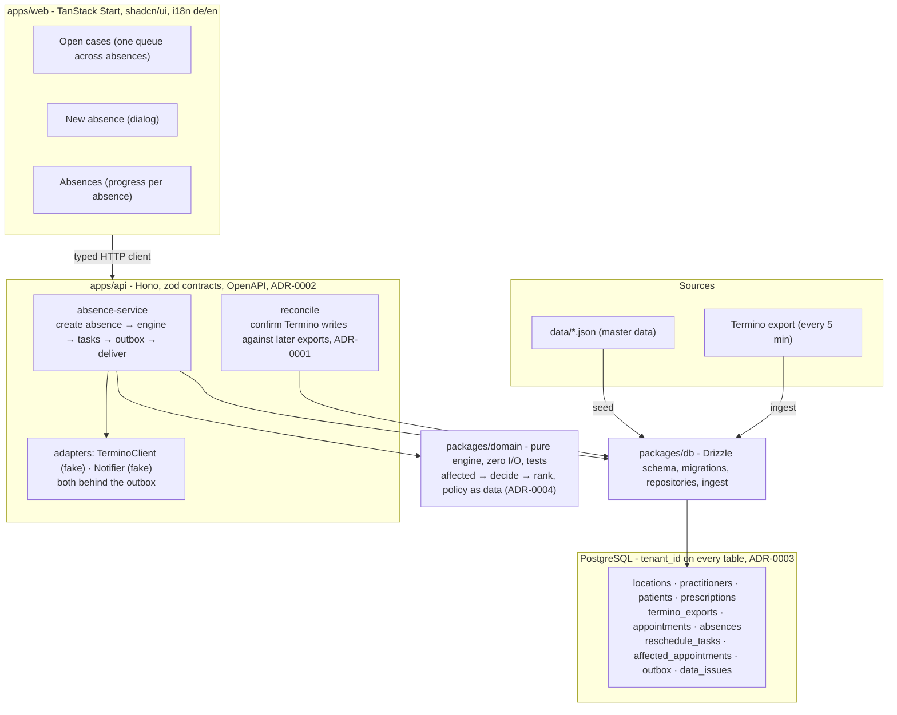
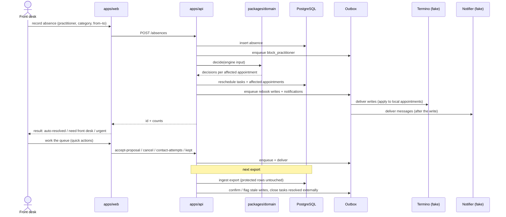

# Architecture

How the system works today, and how it scales to a tenant-based system with 100+ practices. Decisions with their reasons live in `docs/adr/`; this file is the map.

## 1. What it does

A practitioner becomes absent (sick, emergency, planned). The rescheduling engine looks at every affected appointment, rebooks what it can safely rebook, notifies the patients, and hands the rest to the front desk as reschedule tasks in one queue. The front desk works the queue. Every action is written to Termino (the external booking tool) through an outbox and confirmed against later Termino exports.

## 2. Today (case study)

One tenant (meinphysio+), two locations, seven practitioners. Master data is seeded from `data/*.json`. Termino appointment exports arrive every 5 minutes (JSON, window about 2 weeks back to 1 week ahead). Termino is fictional: reads come from the export files, writes go to a fake client.

### Components

Three processes (`db`, `api`, `web`) via Docker Compose, plus two libraries. `packages/domain` imports nothing; `packages/db` imports only domain types.

### Flow for one absence

1. The front desk records the absence (practitioner, category, date-time range). The API blocks the practitioner in Termino (outbox row, ADR-0001).
2. The engine (`packages/domain`) finds affected appointments, decides each one, and ranks the tasks. Imminent → same-time swap or front desk. Auto-rebook when the policy allows (qualification match, same location, ±2 days, gap fits, patient contactable; ADR-0004). Else proposal or front desk. When same-day coverage is impossible, a cancellation notice for today goes out.
3. Decisions become reschedule tasks (one per patient per absence). Auto-rebookings become Termino writes plus notifications in the outbox; the fake adapters deliver them.
4. The front desk works the queue. Quick actions (accept proposal, cancel and notify, log contact attempt, kept) call the API, which writes through the outbox.
5. Each new Termino export is ingested idempotently. Reconciliation protects locally written appointments from stale exports, confirms writes per type, flags writes unconfirmed after two exports, closes tasks resolved externally, and adds tasks for new bookings inside an absence.

Ingest also records what it cannot reconcile as **data issues**: unknown practitioner IDs (`prac_03`), unmatched patients (Lena Krause), fuzzy matches (Katrin Meier/Meyer). They are shown to the front desk; automation does not depend on identity resolution.

## 3. Target: multi-tenant, 100+ practices

Seven cornerstones. Each one builds on something that already exists in the code.

### 3.1 Tenancy: shared schema + row-level security

- A **tenant is a practice group** (for example meinphysio+); locations are sites under it. Every table already carries `tenant_id` (ADR-0003).
- The API resolves the tenant from the auth token (or a tenant header for service calls) into a request context. Every repository call takes the tenant id. No query without it.
- Isolation is enforced **in the database**, not only in application code: PostgreSQL row-level security with a `SET app.tenant_id` per transaction. Tests prove that a tenant A request can never read tenant B rows.
- Schema-per-tenant or database-per-tenant only if a tenant needs it for compliance. The repository layer makes that a deployment choice, not a code rewrite.

### 3.2 Connectors: one interface per booking tool

- Today: one fake `TerminoClient`. Target: a connector interface per booking tool, with per-tenant configuration (credentials, export source, polling cadence).
- The outbox + reconciliation pattern (optimistic writes, confirm against later exports, ADR-0001) is connector-agnostic and stays.
- Same for notifications: the `Notifier` interface gets real SMS/email providers per tenant, per-patient channel preference, delivery receipts, and confirm/decline links so patients can answer an automated rebooking.

### 3.3 Outbox worker: delivery out of the request path

- A separate worker process drains the outbox with retries, backoff, a circuit breaker, and idempotency keys (ADR-0001 consequences). The API only enqueues.
- Per-tenant rate limits and quotas on booking-tool writes and notifications: a noisy tenant cannot delay another tenant.

### 3.4 Data at scale

- 100 practices × ~2,000 appointments per export window ≈ **200k upserts every 5 minutes**.
- Ingest in chunks (already done), ingest as a scheduled job per tenant with lag metrics, partition `appointments` by tenant (and optionally by month), retention policy on export snapshots, index on (`tenant_id`, `termino_practitioner_id`, `starts_at`).
- The API stays stateless and scales horizontally. The engine is pure and cheap: one absence is one in-memory computation over the tenant's window.

### 3.5 Configuration per tenant

- The auto-rebook policy, priority ranking, prescription-warning thresholds, message templates, and service-label mapping are already data, not code (ADR-0004).
- They move into a `tenant_settings` table with defaults. Locale is per tenant with a per-user override (`de` today, `en` next).

### 3.6 Operations and compliance (GDPR)

- Logs, metrics, and traces carry `tenant_id`. Alerts per tenant: unconfirmed writes, failed deliveries, ingest lag. Incident blast radius is one tenant.
- Health-adjacent personal data: EU hosting, encryption at rest, audit log of access to patient data, data-processing agreements per tenant, export and deletion per patient and per tenant (tenant exit = delete by `tenant_id`).
- Notifications are outbound personal data: log recipient and channel, not message bodies, once real providers exist.

### 3.7 Auth and roles

- Front-desk users, practice managers, and admins per tenant; single sign-on for practice groups.
- Authorization sits in the API. The UI only hides.

### Migration path

Each step leaves the system working.

1. **Tenant context in the API**: resolve the tenant from auth/header, thread it through every repository call (today: a constant default tenant).
2. **Row-level security**: policies on every table, tests that prove isolation. One ADR.
3. **Outbox worker + real adapters**: delivery out of the request path; real Termino client and notification provider for the first tenant; circuit breaker and staleness alerts.
4. **Per-tenant configuration**: policy, ranking, templates, service mapping in `tenant_settings`.
5. **Ingest as a job**: scheduled per tenant with lag metrics; partitioning when the first tenant exceeds the window size that hurts.
6. **Onboarding without deploys**: a new practice = tenant row + connector config + master-data import + first ingest.
7. **Auth + roles**, then patient self-service (confirm/decline links), then the day-plan calendar view (vertical time, practitioners as columns).

## 4. Decisions (ADRs)

- ADR-0001 — Termino through one adapter; outbox; optimistic writes reconciled against exports.
- ADR-0002 — Dedicated, explicit HTTP API instead of framework-embedded server functions.
- ADR-0003 — `tenant_id` from day one; RLS deferred.
- ADR-0004 — Auto-rebook policy and ranking as data in the domain package.

## 5. Status

What is done and what is open lives in one place: `README.md` → **Status** and **Next steps**.
